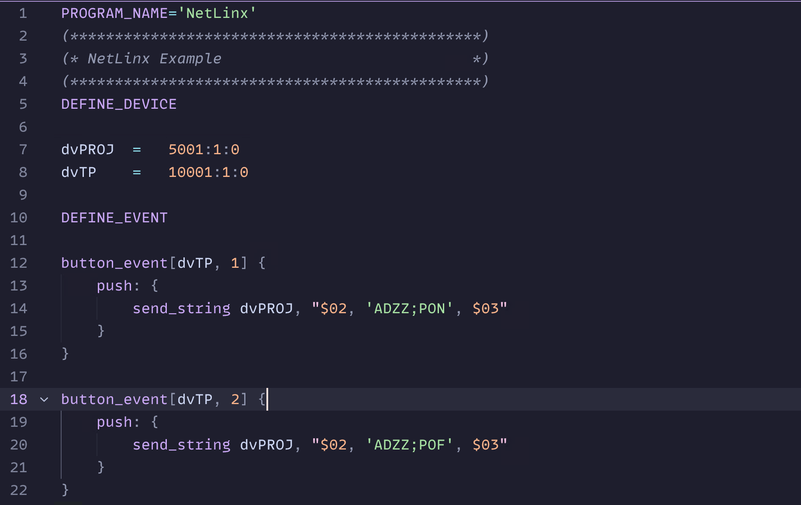

# zed-netlinx

A [NetLinx][netlinx] extension for [Zed][zed].

[netlinx]: https://www.amx.com/en/site_elements/amx-language-reference-guide-netlinx/programming-language
[zed]: https://zed.dev

## Features

- Syntax Highlighting
- Basic Code Snippets
- Outlining

## LICENSE

[MIT](./LICENSE)
